# Konecta Week 6 (Terraform)

### Q2 

Terraform modules are reusable packages of configurations that simplifies the codebase, reduces duplication, and improves maintainability. I will be using modules in these 2 architectures in this project to organize the networking and EC2 resources for better reusability and maintainablity across the 2 architectures
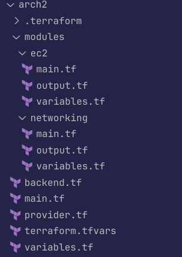

## Arch1

### Q1
Usage of tfvars:
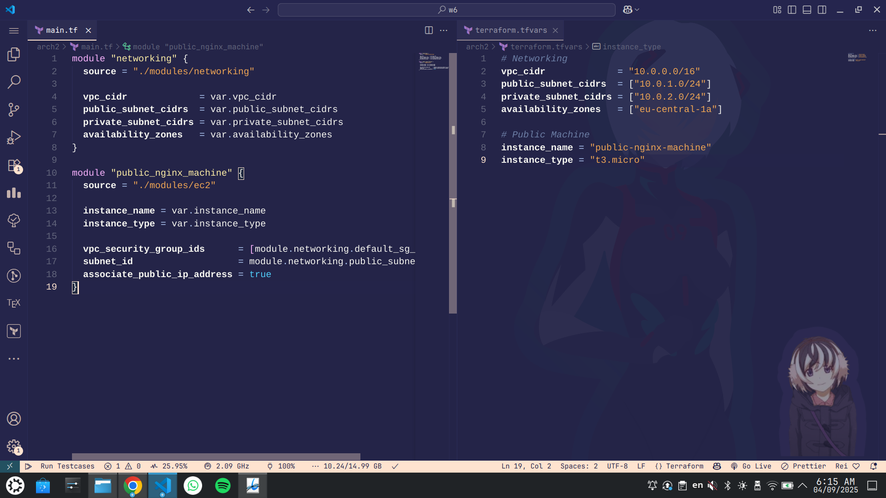
Successful terraform apply:
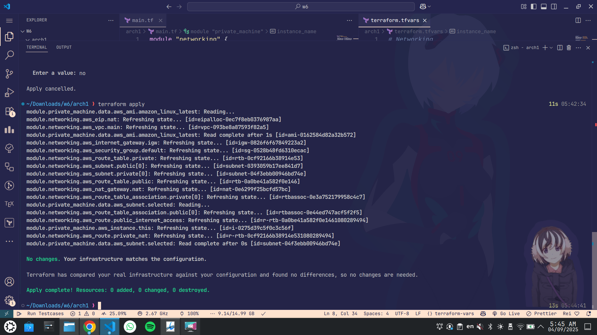
Success on AWS:
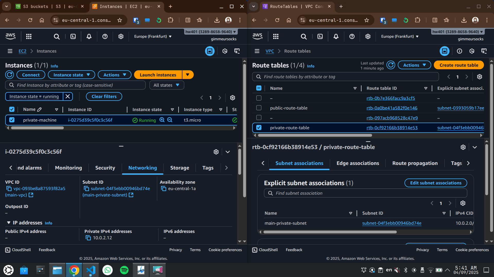

### Q5
First list the current state:
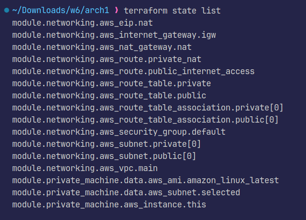
Then remove the resource that you want to keep:
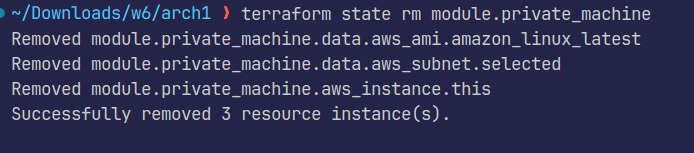
Then destroy the current stack (without the EC2):
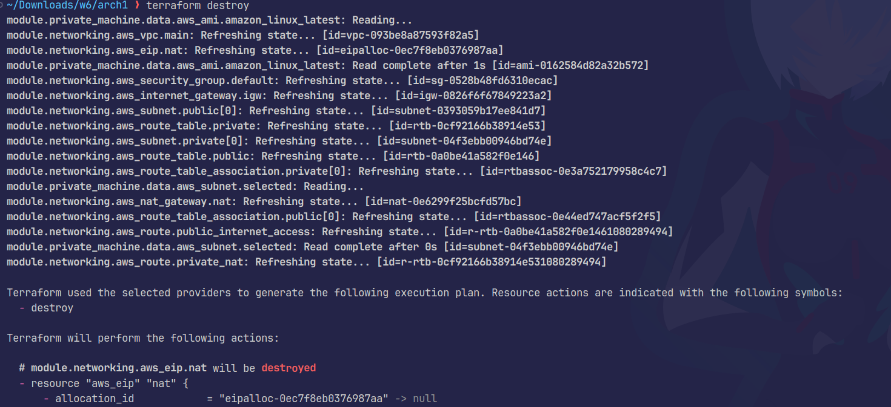
This will never be deleted, since the instance is still inside the private subnet in a vpc, so add them to the state removal command

Now we destroy manually

### Q6
Adding a lifecycle, prevent_destroy:
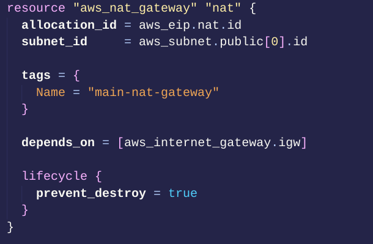
Does not allow the destruction of nat_gateway resource:
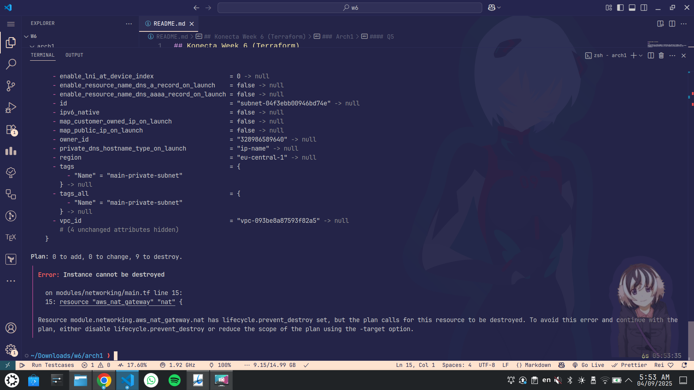

## Arch2

### Q3
Add a variable that takes in user_data file name for a file that installs nginx and sets it up:
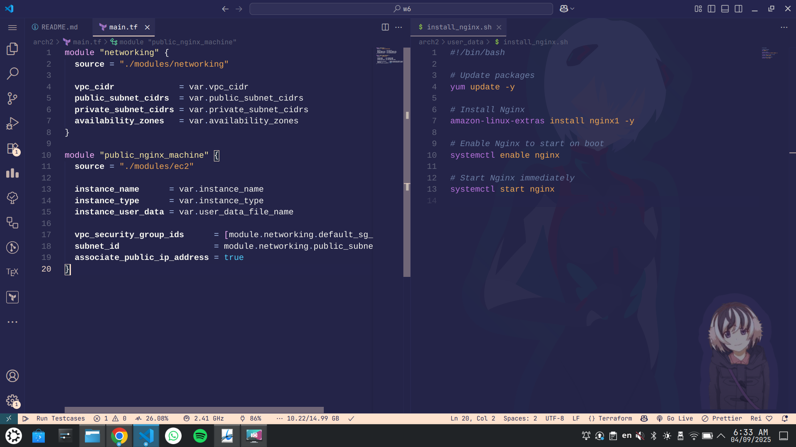
Add output for the public_dns for the nginx machine, make sure the security group allows tcp inbound access:
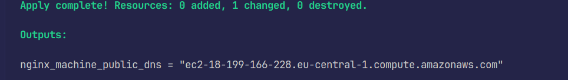
Testing the endpoint:
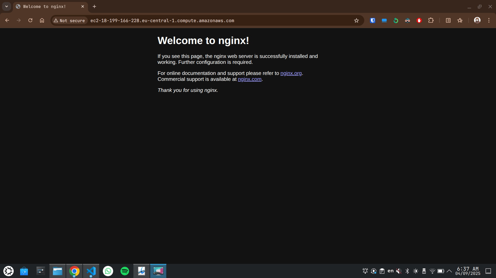

### Q4
Collaboration can be done using setting up an S3 bucket, with versioning:
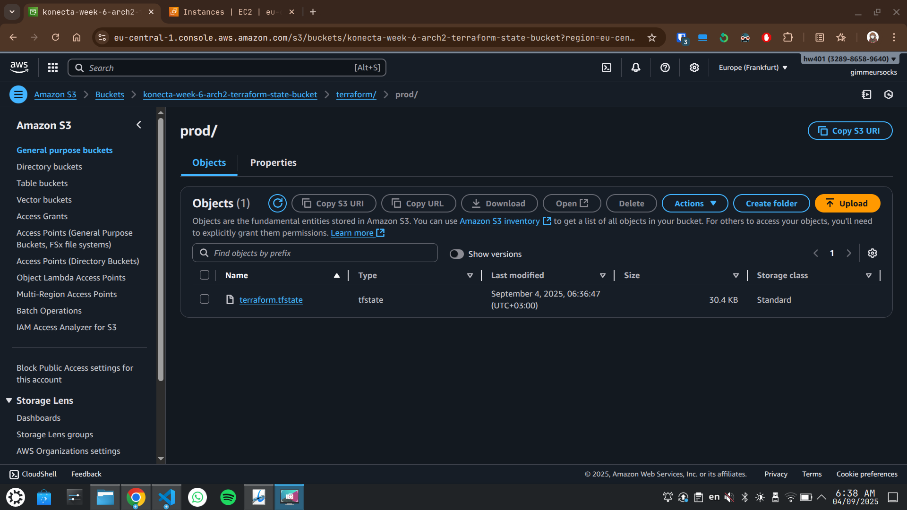
Then setting up the backend to start uploading to it:
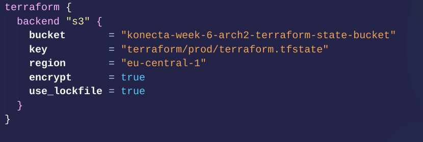
